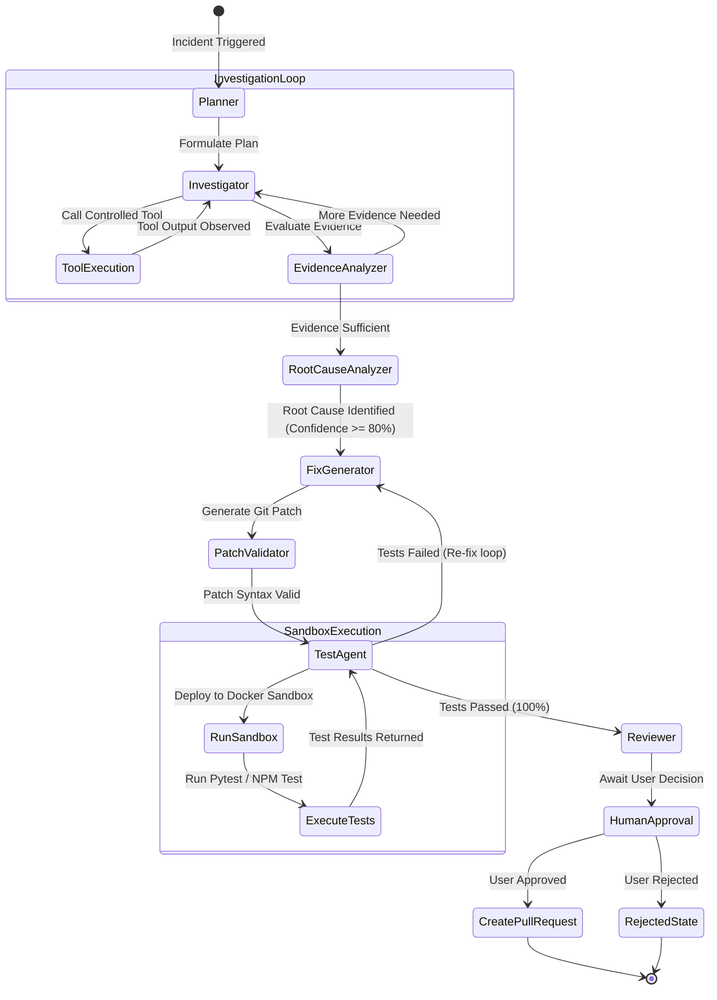
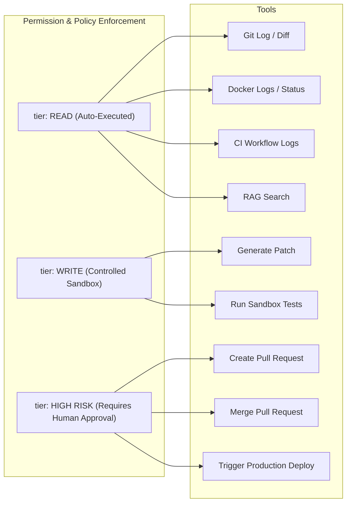

# Agent Architecture Specification — LangGraph Orchestration

## 1. LangGraph Cyclic State Engine

The agentic AI engine is powered by **LangGraph**. Unlike linear prompt chains, LangGraph allows conditional looping, iterative tool selection, evidence accumulation, patch generation, sandbox testing, and human gatekeeping.

---

## 2. Agent Graph Nodes & Roles

### 2.1 `planner` Node
- **Inputs**: Incident record (title, repository, deployment metadata, initial error snippet).
- **Task**: Analyzes initial alert signals and formulates a structured investigation plan.
- **Output**: Order of tools to invoke (e.g. `1. Get workflow logs`, `2. Get commit diff`, `3. Search app logs`).

### 2.2 `investigator` Node
- **Inputs**: Plan, previous tool outputs, workspace context.
- **Task**: Executes tools (Git, GitHub, Docker, Logs, RAG) with safety budget enforcement.
- **Output**: Raw tool observations attached to graph state.

### 2.3 `evidence_analyzer` Node
- **Inputs**: Cumulative tool observations.
- **Task**: Synthesizes raw text into structured evidence items (`EV-01`, `EV-02`) with timestamp, source, and severity. Evaluates whether sufficient evidence exists.
- **Output**: Decision condition (`continue_investigation` vs `proceed_to_rca`).

### 2.4 `root_cause_analyzer` Node
- **Inputs**: Structured evidence items.
- **Task**: Determines the exact underlying root cause and assigns a confidence score (0-100%).
- **Output**: Root cause explanation and list of cited evidence IDs.

### 2.5 `fix_generator` Node
- **Inputs**: Root cause explanation, affected repository files.
- **Task**: Generates code modification and formatted `.patch` diff.
- **Output**: Proposed fix patch.

### 2.6 `test_agent` Node
- **Inputs**: Proposed `.patch` diff, target repository URL/path.
- **Task**: Spawns isolated Docker container, applies patch, executes test suite (`pytest`, `npm test`), collects health metrics.
- **Output**: Test pass/fail summary (`passed_count`, `failed_count`, `build_status`).

### 2.7 `reviewer` Node
- **Inputs**: Fix patch, test results, risk evaluation.
- **Task**: Prepares human approval payload and pauses graph execution awaiting user approval.
- **Output**: Awaiting human input signal.

---

## 3. Tool Permission & Risk Policy

Every tool accessible by the agent is explicitly categorized into a permission tier:

