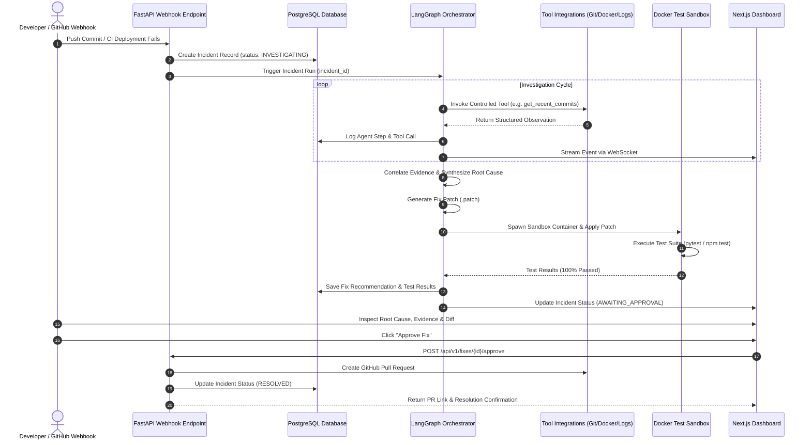

# Data Flow & Lifecycle Specification — AI DevOps Incident Resolution Agent

## 1. End-to-End Incident Data Flow



---

## 2. Graph State Schema (`AgentState`)

```python
class AgentState(TypedDict):
    incident_id: str
    repository_url: str
    branch: str
    deployment_id: str
    
    # Investigation & Reasoning
    plan: List[str]
    observations: List[Dict[str, Any]]
    evidence: List[Dict[str, Any]]
    
    # RCA & Fix
    root_cause: Optional[str]
    confidence_score: float
    cited_evidence_ids: List[str]
    proposed_patch: Optional[str]
    
    # Sandbox Validation
    test_passed: bool
    test_output: Optional[str]
    risk_level: str  # LOW, MEDIUM, HIGH
    
    # Human Gatekeeping
    approval_status: str  # PENDING, APPROVED, REJECTED
```

---

## 3. Data Retention & Privacy Principles
1. **Sanitization**: All log streams are sanitized for sensitive secrets (API keys, passwords, JWT tokens) before being processed by the LLM or stored in the database.
2. **Auditability**: Every tool call, prompt template, raw response, and user action is recorded with microsecond timestamps in `audit_logs`.
3. **Immutability**: Historical evidence objects and test results associated with resolved incidents are immutable.
