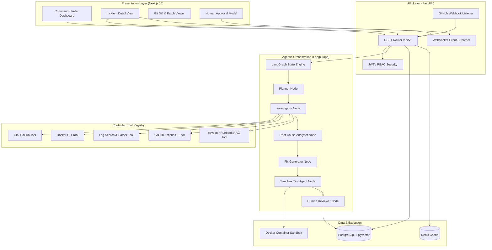

# System Architecture Specification — AI DevOps Incident Resolution Agent

## 1. Multi-Tier Architecture Overview

The system is structured into four primary layers:
1. **Presentation Layer (Frontend)**: Next.js 16 Web Dashboard with Tailwind CSS, Lucide icons, and real-time state streaming.
2. **API & Orchestration Layer (Backend)**: FastAPI server handling REST endpoints, webhooks, authentication, and LangGraph agent graphs.
3. **Integration Layer (Controlled Tools)**: Permissions-enforced tool drivers for GitHub, Git, Docker, Log Parsers, and CI/CD runs.
4. **Data & Execution Layer (Storage & Sandbox)**: PostgreSQL with `pgvector`, Redis cache/locks, and Docker Container Sandbox.

---

## 2. Infrastructure & Communication Protocols

### 2.1 Communication Channels
- **HTTP / HTTPS**: Used for RESTful client-server requests and GitHub Webhook ingestion.
- **WebSocket (WS / WSS)**: Real-time streaming of live agent tool calls, thinking steps, and status logs to the UI.
- **Docker Socket (`unix:///var/run/docker.sock` / Named Pipe)**: Controlled Docker API communication for container inspection and sandbox creation.

### 2.2 Component Responsibilities

| Component | Technology | Primary Function |
| :--- | :--- | :--- |
| **Frontend UI** | Next.js 16, React 19, TypeScript, Tailwind CSS | Operator command center dashboard, incident detail timeline, diff review |
| **Backend Core** | Python 3.12, FastAPI, Pydantic v2 | API routing, webhook validation, authentication, task orchestration |
| **Agent Framework** | LangGraph, LangChain Core | Cyclic multi-node state graph, tool invocation, evidence correlation |
| **Database** | PostgreSQL 16 + `pgvector` | System persistence (incidents, tool logs, fixes) + vector RAG embeddings |
| **Cache & Locks** | Redis 7 | Task locking, temporary agent execution state, query caching |
| **Container Sandbox** | Docker Engine | Isolated execution environment for applying patches and running tests |
